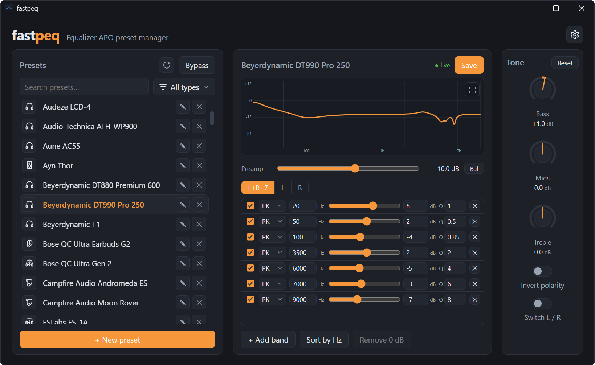
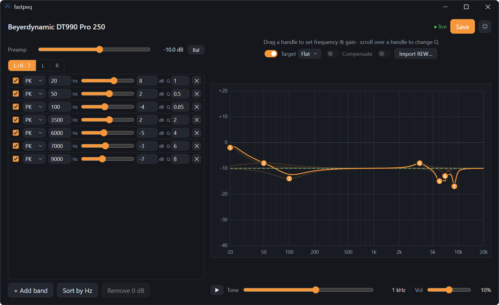

# fastpeq

A fast, clean, High-DPI-friendly preset manager for [Equalizer APO](https://equalizerapo.com/)
— a lightweight alternative to PEACE.



## Why

PEACE is the de-facto Equalizer APO GUI, but it's slow, **restarts its engine on
every preset switch**, clutters APO's config folder, and scales poorly on
High-DPI displays. The one modern alternative, Mega Switcher, has been
unmaintained since 2022.

fastpeq leans on a fact PEACE ignores: **Equalizer APO watches `config.txt` and
live-reloads it**. So switching a preset is just an atomic file write — instant,
no restart, no process churn.

## Features

- **Instant preset switching** — an atomic `config.txt` write; no engine restart, no process churn.
- **Parametric band editor** — add / remove / enable bands, edit type and Fc / Gain / Q inline.
  Supports `PK`, `LS`, `HS`, `LSC`, `HSC`, `LP`, `HP`, `LPQ`, `HPQ`, `BP`, `NO`, `AP`.
- **Live response curve** — a client-side RBJ-biquad magnitude plot that updates as you type.
- **Expanded curve editor** — a full-window graph with draggable band handles (drag to set
  frequency & gain, scroll to change Q), a filter-shape overlay, per-channel (L / R) editing,
  **undo / redo** (`Ctrl+Z` / `Ctrl+Y`), and **A/B compare** against the last-saved version.
- **Target curves & compensation** — import a reference target (REW/CSV text), overlay it, and
  view the response as deviation from it, with a live FR-to-target dB gap at the cursor and
  per-preset **offset / align-at-frequency** controls.
- **Measurement overlay** — import a REW measurement per preset to see the corrected response.
- **Preamp, balance & tone** — a preamp with an optional **Auto** mode that keeps the EQ from
  clipping, channel balance, global bass / mid / treble tone controls (with polarity invert and
  L / R swap), and a sine tone generator.
- **Preset organisation** — search, device-type filter, and per-preset category icons.
- **Configurable global hotkeys** — bind any number of `Ctrl+Alt` / `Ctrl+Shift` keys to switch
  presets, toggle bypass, or nudge / reset the tone controls, working anywhere in Windows.
- **Hardware EQ offload** — send a preset's first bands to a supported DAC/amp that runs
  parametric EQ in hardware (currently the **Moondrop DHA15**); overflow bands stay in Equalizer
  APO. The hardware EQ persists in the device and keeps working even when fastpeq is closed.
- **System tray**, single-instance, first-run backup of your config.
- **PEACE import** — bring your existing `.peace` presets across.



## Installation

1. Install [Equalizer APO](https://sourceforge.net/projects/equalizerapo/) (the audio engine
   fastpeq drives) and reboot if prompted.
2. Download the latest installer from the [**Releases**](https://github.com/brpjerry/fastpeq/releases)
   page:
   - `fastpeq_<version>_x64-setup.exe` — NSIS installer (recommended), or
   - `fastpeq_<version>_x64_en-US.msi` — MSI installer.
3. Run it and launch fastpeq. It auto-detects APO; on first run it backs up your existing
   `config.txt` before taking over preset switching.

> Windows 10/11, x64. fastpeq edits only the `Preamp:`/`Filter:` lines it manages and preserves
> everything else in your config verbatim.

## Building from source

Requires the **Rust toolchain (MSVC)** and **Node.js**.

```sh
# Core library only (fast; no frontend needed) — the default workspace member.
cargo test                      # parse/serialize + store/writer/manager suites
cargo test -- --ignored         # also the live APO-detection smoke test

# Full app
npm install
npm run tauri dev               # run fastpeq with hot-reload
npm run tauri build             # produce the NSIS + MSI installers

# Frontend checks
npm run check                   # svelte-check (types)
npx vitest run                  # unit/component tests
```

## Design

A hard split between a UI-agnostic Rust core and a thin Tauri + Svelte shell.

| Component | Role |
|-----------|------|
| `crates/fastpeq-core` | Detect APO, parse/edit/serialize configs, preset store, atomic writes, hardware/software split + biquad math (`offload`) |
| `src-tauri` | Tauri 2 commands, system tray, configurable global hotkeys, single-instance, hardware-EQ device I/O (`hardware/`) |
| `src/` | Svelte + TS UI: preset list, band editor, response curve, curve editor |

The core models an APO configuration as an ordered list of lines. It only understands `Preamp:`
and `Filter:` lines; everything else (`Include:`, `Device:`, `GraphicEQ:`, `Convolution:`,
comments) is preserved **verbatim** so edits never mangle a user's config. The correctness
guarantee is a lossless model round-trip:

```
parse(serialize(config)) == config
```

Unrecognised types or variants that can't be reproduced faithfully (e.g. `LS 6dB`) are kept as
raw lines rather than coerced.

### Hardware EQ offload

Some DACs/amps can run parametric EQ on-chip. fastpeq can route a preset's EQ between Equalizer APO
and such a device. Under **Settings → Hardware EQ offload** a single control (adjustable with
nothing connected) picks the routing; offload **follows your active output device** and engages only
while the current default output is a supported device — switch to a different output and nothing is
offloaded:

- **APO Only** — offload off; every band stays in Equalizer APO.
- **First X** — the first X bands (X = the device's budget) go to hardware, the rest to APO.
- **Biggest effect** — the X bands that alter the response most (largest area under the bell/shelf).
- **Min. APO preamp** — the boosts, so Equalizer APO's preamp stays near 0 and the device's pregain
  handles the headroom (forces the editor's **Auto Preamp** on so the APO bands can't clip).
- **Hardware Only** — run everything on the device where it fits (selection tuning in progress).

The band editor marks each offloaded band with a **HW** chip, so you can see exactly which bands
the device is running versus Equalizer APO. While offload is on, the preamp control splits into two
sliders — **APO** (the software remainder) and **Device** (the hardware pregain) — so each gain
stage can be set independently (Auto sizes both to avoid clipping).

The split logic and the device biquad math are pure and live in `fastpeq_core::offload`; the
USB/HID I/O lives in the shell (`src-tauri/src/hardware/`), mirroring how Windows output-device
switching is isolated in `audio.rs`. Each device family is a self-contained *driver*, so adding
hardware means adding a driver and registering it. A dedicated worker thread **rate-limits** and
coalesces updates, since devices can't be rewritten as fast as APO's file reload; live edits go to
volatile RAM and an applied preset is committed to the device's flash.

> The Moondrop protocol is community **reverse-engineered** (no official spec); see the driver in
> `src-tauri/src/hardware/moondrop.rs`. Set `FASTPEQ_HW_DRYRUN=1` to log device packets without
> sending them. The DHA15 driver is validated against real hardware by an ignored test:
> `cargo test -p fastpeq -- --ignored dha15` (writes to RAM only).

## Roadmap

1. **Core** ✅ — model, parser, serializer, round-trip tests, APO detection.
2. **Switch MVP** ✅ — atomic `config.txt` writer, preset store, tray switching, bypass hotkey,
   single-instance, first-run config backup.
3. **Editor** ✅ — parametric band CRUD, preamp/balance, live response curve.
4. **Curve editor & presets** ✅ — expanded graph with draggable handles, target curves &
   compensation, REW measurement overlay, tone generator, PEACE import.
5. **Tooling & hotkeys** ✅ — editor undo/redo, A/B compare, auto-preamp, target offset/align,
   and a configurable global-hotkeys page.
6. **Polish** *(next)* — autostart, an audio-output-device hotkey action, richer target tooling.
